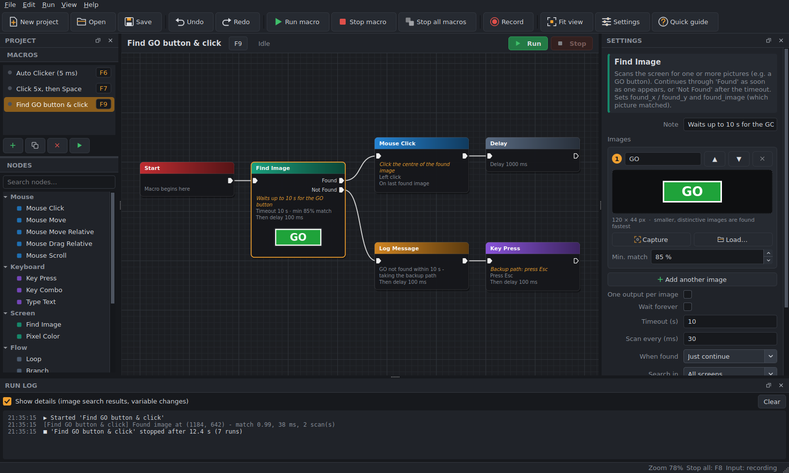

# MacroFlow for Windows

MacroFlow automates your mouse and keyboard. You build a macro by dragging blocks onto a canvas and wiring them together, like Unreal Engine's Blueprint editor: clicks, key presses, loops, variables and on-screen image search, started and stopped with hotkeys.

## [⬇ Download MacroFlow 1.0.7](https://github.com/ItsElton/MacroFlow-releases/releases/latest/download/MacroFlow-windows.zip)

The newest version, 109 MB zip, released 2026-09-29.

**Install:** unzip it into a folder of your own (not *Program Files*) and run `MacroFlow/MacroFlow.exe`. There is no installer and nothing else to download. Windows 10 or 11. If Windows shows *"Windows protected your PC"*, click **More info → Run anyway** (the app isn't code-signed).

**Update:** in MacroFlow, use **File → Check for Updates…**. It shows what's new and updates in one click, keeping your open project.

## All versions

| Version | Released | Download |
|---|---|---|
| [**1.0.7** (latest)](#macroflow-107) | 2026-09-29 | [MacroFlow-windows.zip](https://github.com/ItsElton/MacroFlow-releases/releases/download/v1.0.7/MacroFlow-windows.zip) (109 MB) |
| [1.0.6](#macroflow-106) | 2026-09-28 | [MacroFlow-windows.zip](https://github.com/ItsElton/MacroFlow-releases/releases/download/v1.0.6/MacroFlow-windows.zip) (109 MB) |
| [1.0.5](#macroflow-105) | 2026-09-28 | [MacroFlow-windows.zip](https://github.com/ItsElton/MacroFlow-releases/releases/download/v1.0.5/MacroFlow-windows.zip) (109 MB) |
| [1.0.4](#macroflow-104) | 2026-09-28 | [MacroFlow-windows.zip](https://github.com/ItsElton/MacroFlow-releases/releases/download/v1.0.4/MacroFlow-windows.zip) (109 MB) |
| [1.0.3](#macroflow-103) | 2026-09-28 | [MacroFlow-windows.zip](https://github.com/ItsElton/MacroFlow-releases/releases/download/v1.0.3/MacroFlow-windows.zip) (109 MB) |
| [1.0.2](#macroflow-102) | 2026-09-28 | [MacroFlow-windows.zip](https://github.com/ItsElton/MacroFlow-releases/releases/download/v1.0.2/MacroFlow-windows.zip) (109 MB) |
| [1.0.1](#macroflow-101) | 2026-09-28 | [MacroFlow-windows.zip](https://github.com/ItsElton/MacroFlow-releases/releases/download/v1.0.1/MacroFlow-windows.zip) (109 MB) |
| [1.0.0](#macroflow-100) | 2026-09-28 | [MacroFlow-windows.zip](https://github.com/ItsElton/MacroFlow-releases/releases/download/v1.0.0/MacroFlow-windows.zip) (109 MB) |

### MacroFlow 1.0.7

Released 2026-09-29 · [⬇ Download](https://github.com/ItsElton/MacroFlow-releases/releases/download/v1.0.7/MacroFlow-windows.zip) (109 MB) · [Release page](https://github.com/ItsElton/MacroFlow-releases/releases/tag/v1.0.7)

- **Find Image clicks land.** When *Move to it and click* found the picture but the click did nothing, it's fixed. The mouse now arrives the way a real mouse does, MacroFlow waits a moment before pressing, and it holds the button down for 20 ms. The new **Hold** setting on Find Image changes that time.
- **Clicks go through MacroFlow's own window.** Image search sees through MacroFlow while a macro runs, so a picture could be found behind MacroFlow's window, and the click then hit MacroFlow instead of your app. Now MacroFlow moves its window behind other windows before clicking there. Mouse Click blocks do the same.
- **Searching in an application re-checks the front.** If another window took the focus while Find Image was searching in an application, that application is brought back to the front before the click.
- **Clicked … in the Run Log.** Find Image now logs where it clicked. If the app you're clicking runs as administrator, which makes Windows block MacroFlow's clicks, the Run Log tells you to start MacroFlow as administrator too.

### MacroFlow 1.0.6

Released 2026-09-28 · [⬇ Download](https://github.com/ItsElton/MacroFlow-releases/releases/download/v1.0.6/MacroFlow-windows.zip) (109 MB) · [Release page](https://github.com/ItsElton/MacroFlow-releases/releases/tag/v1.0.6)

- **Notes in the Run Log.** When a block with a *Note* runs, its note is written to the Run Log (marked ✎), so you can follow along and see where a macro got to. A block in a fast loop logs its note at most once a second.
- **See where the macro is.** While a macro runs with MacroFlow open, the block it is on glows and pulses green with a ▶ badge.
- **See where it goes next.** During a block's Delay (and during Delay blocks), the wire it is about to follow pulses, with dashes flowing towards the next block.
- **Macros no longer drag what you're holding.** If you're holding a mouse button when a macro moves or clicks the mouse, MacroFlow lets go of it first, so nothing you were clicking on gets dragged across the screen. You can choose to have it wait until you let go instead (Settings).
- **Your mouse goes back where it was.** After a macro clicks or moves somewhere, the cursor returns to where you had it, unless a later step still needs it there (e.g. a click at the current position). This can be turned off in Settings.

### MacroFlow 1.0.5

Released 2026-09-28 · [⬇ Download](https://github.com/ItsElton/MacroFlow-releases/releases/download/v1.0.5/MacroFlow-windows.zip) (109 MB) · [Release page](https://github.com/ItsElton/MacroFlow-releases/releases/tag/v1.0.5)

- **Search inside an application.** Find Image has a new *Search in: Application window* option. Choose the app from a list of open windows and MacroFlow searches only inside that window, wherever it is on screen.
- **Click inside an application.** Mouse Click and Mouse Move can use a *Position in application window*, measured from the window's top-left corner, so the click still lands in the right place when the window moves. Pick the spot on screen and MacroFlow measures it for you.
- **New Apps blocks:**
  - *Open Application* starts a program, file or website and waits for its window.
  - *Focus Window* brings a window to the front, so key presses and typing go to it.
  - *Close Application* closes a window like clicking its X, or ends the program.

### MacroFlow 1.0.4

Released 2026-09-28 · [⬇ Download](https://github.com/ItsElton/MacroFlow-releases/releases/download/v1.0.4/MacroFlow-windows.zip) (109 MB) · [Release page](https://github.com/ItsElton/MacroFlow-releases/releases/tag/v1.0.4)

- **Edit recordings.** The Recording block has a new *Edit recording…* button. It lists every recorded step, where you can change pauses, keys, mouse buttons, positions and scrolling, delete steps, add clicks, key presses, scrolls or mouse moves, and remove all mouse movement at once. Nothing changes until you click Save, and Undo works afterwards.
- **Scroll bars fixed** in the update window's change list and in the Quick guide.

### MacroFlow 1.0.3

Released 2026-09-28 · [⬇ Download](https://github.com/ItsElton/MacroFlow-releases/releases/download/v1.0.3/MacroFlow-windows.zip) (109 MB) · [Release page](https://github.com/ItsElton/MacroFlow-releases/releases/tag/v1.0.3)

- **Delay after each block.** Mouse, keyboard, Find Image, Pixel Color, Recording, Run Macro, Set Variable and Log Message blocks have a new *Delay* setting: how long to wait before the next block starts. New blocks use 100 ms. Blocks in projects saved before this update keep 0, so your existing macros run as before.
- **Find Image no longer finds pictures inside MacroFlow.** While a macro runs, MacroFlow's own windows are hidden from screen searches, so the picture shown on a Find Image block can't be matched by mistake.
- **Recording** (was *Play Recording*) is now under *Flow*.
- **Delay** is the new name of the *Wait* block.
- **Mouse Click** actions are now *Click*, *Double-click*, *Mouse Click Down* and *Mouse Click Up*.
- **Key Press** actions are now *Keystroke (Press and Release)*, *Key Down* and *Key Up*.

### MacroFlow 1.0.2

Released 2026-09-28 · [⬇ Download](https://github.com/ItsElton/MacroFlow-releases/releases/download/v1.0.2/MacroFlow-windows.zip) (109 MB) · [Release page](https://github.com/ItsElton/MacroFlow-releases/releases/tag/v1.0.2)

- Update popup shows only what changed

### MacroFlow 1.0.1

Released 2026-09-28 · [⬇ Download](https://github.com/ItsElton/MacroFlow-releases/releases/download/v1.0.1/MacroFlow-windows.zip) (109 MB) · [Release page](https://github.com/ItsElton/MacroFlow-releases/releases/tag/v1.0.1)

- Show a preview of the editor on the download page

### MacroFlow 1.0.0

Released 2026-09-28 · [⬇ Download](https://github.com/ItsElton/MacroFlow-releases/releases/download/v1.0.0/MacroFlow-windows.zip) (109 MB) · [Release page](https://github.com/ItsElton/MacroFlow-releases/releases/tag/v1.0.0)

MacroFlow automates your mouse and keyboard. You build a macro by dragging blocks onto a canvas and wiring them together, like Unreal Engine's Blueprint editor, then start it with a hotkey.

**What's in it**

- **Visual editor** - drag, connect and edit blocks, with zoom, copy/paste and undo/redo. Three example macros are included to start from.
- **Mouse** - left, right, middle and side-button clicks (as fast as one every 5 ms), move, move relative, drag relative and scroll.
- **Keyboard** - single keys with separate left/right Shift, Ctrl, Alt and Win, key combos, and typing any text.
- **Record & replay** - record your mouse and keyboard, then replay it faster or slower as part of a macro.
- **Find Image** - wait for one or more pictures to appear on screen, then click them or carry on. If none shows up before the timeout, the macro takes a different path.
- **Pixel Color** - wait for a point on screen to change colour.
- **Loops and branches** - repeat a set number of times, forever, or while a condition is true, then move on to the next step. Branch on conditions, and call other macros.
- **Variables** - count, calculate and use values anywhere, e.g. `clicks + 1` or `randint(20, 40)`.
- **Hotkeys and run limits** - a start/stop hotkey per macro, a global Stop all (F8), and a limit by number of runs or by time.
- **Updates** - File → Check for Updates shows what's new and installs it in one click, keeping your open project.
